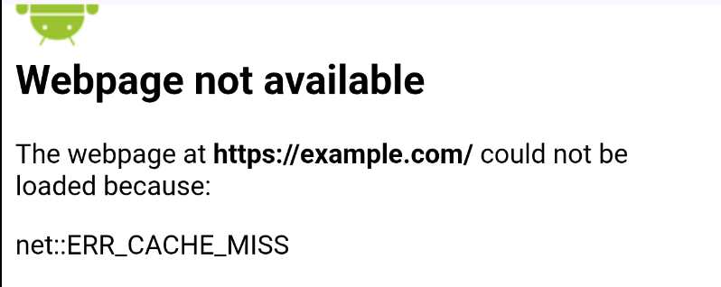
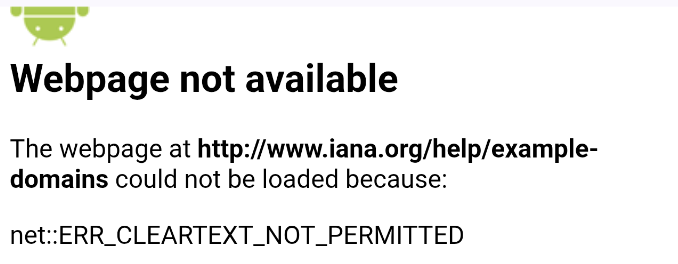

# メモ

とりあえずWebViewまわりで知ったことを雑にこのファイルにまとめる
今後整理するつもりだから一旦雑にメモしていく

## WebView 権限

`AndroidManifest.xml` に `<uses-permission android:name="android.permission.INTERNET"/>` を設定しないでWebViewでアクセスしようとした時は以下のような表示となる



## アプリ外ブラウザ

以下の処理で呼び出せる
端末にブラウザがないときに`ActivityNotFoundException`が発生するため例外処理はあったほうが良い

```kotlin
val intent = Intent(Intent.ACTION_VIEW, < URL >)
context.startActivity(intent)
```

## アプリ内ブラウザ（Custom Tabs）

[Android カスタムタブの概要 - Android Developers](https://developer.android.com/develop/ui/views/layout/webapps/overview-of-android-custom-tabs?hl=ja)

`implementation("androidx.browser:browser:<バージョン>")`の依存が必要

## Partial Custom Tabs

シート状（ハーフシート）で Custom Tabs を表示できる

[部分的なカスタムタブによるマルチタスク - chrome for developers](https://developer.chrome.com/docs/android/custom-tabs/guide-partial-custom-tabs?hl=ja)
[【Android】Custom Tabsの高さを調節してボトムシートのように表示させる方法](https://tech.yappli.io/entry/android-customtabs-bottomsheet)
[Partial Custom Tabを使ってブラウザを良い感じに使う](https://qiita.com/kokada420/items/d5837a7f8823a7ff006a)

## WebView

[Jetpack Compose で雑に WebView を使いたいとき](https://zenn.dev/kaleidot725/articles/2021-11-13-jc-simple-webview)

最も簡単なWebView表示はおそらく以下（難点としては、ページ内のリンクをクリックすると外部ブラウザで開かれてしまう）

```kotlin
AndroidView(
    factory = ::WebView,
    update = { it.loadUrl(url) },
)
```

## セキュリティ

### HTTP通信

[ネットワーク セキュリティ構成 - Android Developers](https://developer.android.com/privacy-and-security/security-config?hl=ja)

Android9以降 `http://〜` のURLで、 `AndroidManifest.xml` に `android:usesCleartextTraffic="true"` を設定しないままWebViewでアクセスしようとした時は以下のような表示となる



全てのURLで`http://〜`を許可するとセキュリティ上よろしくないため 必要なものだけ `network_security_config` を利用する

## WebViewClient

[WebViewClient - Android Developers](https://developer.android.com/reference/android/webkit/WebViewClient)

- WebView内での表示に関するイベントやリクエストの制御を担当するクラス
- `onReceivedError` など公開メソッドを上書きすることで様々な処理が行える
- `onReceivedError` はページにはあまり関係ない外部コンテンツなどのエラーも検知してしまうため以下のように使い分けるといいかもしれない
  - `isForMainFrame` が `true` の場合はメインフレームなので全画面エラー表示
  - `isForMainFrame` が `false` の場合はサブリソース(画像や外部コンテンツなど)なのでエラーは無視

## WebChromeClient

[WebChromeClient - Android Developers](https://developer.android.com/reference/android/webkit/WebChromeClient)

- WebView内でのブラウザの機能（UIに関連するイベント）を制御するためのクラス
- 読み込み進捗やページタイトルを取得などが行える